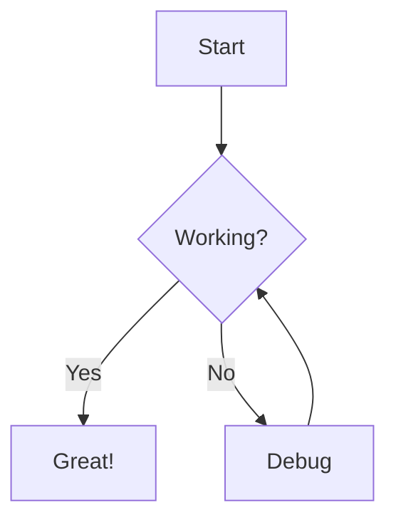
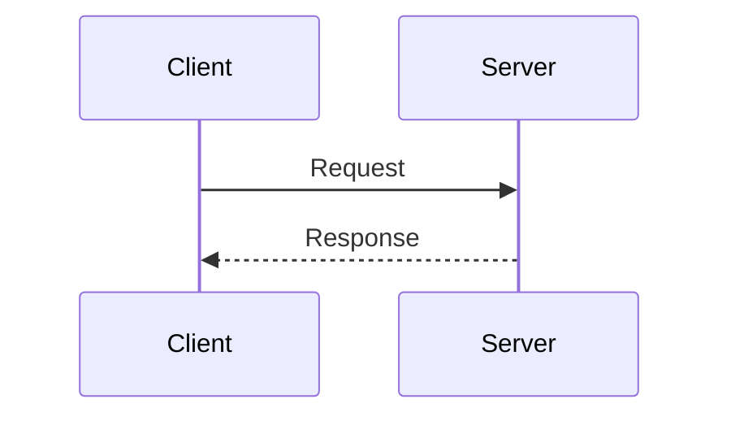

# Markdown Viewer

<div align="center" markdown="1">

**View, export, and translate markdown files — straight from the terminal**

[](LICENSE) [](https://www.python.org/) [](https://pypi.org/project/markdown-viewer-app/) [](SECURITY.md)

</div>

Open any markdown file in a full browser UI with one command. Supports PDF and Word export, Mermaid diagrams, math equations, syntax highlighting, and content translation.

[TOC]

---

## 📦 Installation

```bash
pip install markdown-viewer-app
playwright install chromium
```

> `playwright install chromium` is a **one-time setup** (~140 MB) required for PDF/Word export. Skip it if you don't need export features.

---
## 🚀 Quick Start

```bash
# Open a file in your browser
mdview README.md

# Export to PDF
mdview README.md --export-pdf

# Export to Word
mdview README.md --export-word

# Export to both at once
mdview README.md --export-pdf --export-word

# Render to HTML only (no browser — useful for CI/CD)
mdview README.md --no-browser

# Save HTML to a specific file
mdview README.md -o output.html

# Use a custom port (default is 5000)
# Note: Some ports like 6000 are blocked by Chrome - use 5001, 8000, 8080, etc.
mdview README.md -p 5001

# Stop the background server on a custom port
mdview --stop -p 5001
```

When you run `mdview <file>`, the app:
1. Starts a background server on port 5000 (silently — no extra window opens)
2. Opens your browser directly to the rendered file
3. Returns you to the terminal immediately

The server keeps running in the background. Subsequent `mdview` calls reuse it instantly. Use `-p`/`--port` to run multiple servers on different ports simultaneously.

> **Port Selection:** Chrome and Edge block certain ports for security reasons. For example:
> - **Port 6000-6063**: Blocked because they're used by the X11 windowing system (Unix/Linux). Chrome prevents malicious websites from using your browser to attack local X11 services, which could allow screen capture, keystroke logging, or connection hijacking.
> - **Port 6665-6669**: IRC ports, also blocked for security.
> 
> If you see `ERR_UNSAFE_PORT`, choose a safe port like **5001, 8000, 8080, or 3000**. [Full list of blocked ports](https://chromium.googlesource.com/chromium/src.git/+/refs/heads/main/net/base/port_util.cc).

---
## 🖥️ CLI Reference

```
mdview [file] [options]
```
### Arguments

| Argument | Description |
|----------|-------------|
| `file` | Path to the markdown file to render (optional — prompts interactively if omitted in a terminal) |

### Options

| Flag | Default | Description |
|------|---------|-------------|
| `-o`, `--output <path>` | *(temp file)* | Save rendered HTML to this path instead of a temporary file |
| `--no-browser` | off | Render without opening a browser window |
| `--keep` | off | Keep the HTML output file after rendering (saved as `<filename>.html` next to the source) |
| `--export-pdf [path]` | — | Export to PDF; optionally specify an output path |
| `--export-word [path]` | — | Export to Word (`.docx`); optionally specify an output path |
| `--share-pdf` | — | Export to PDF and open your email client with it attached |
| `--share-word` | — | Export to Word and open your email client with it attached |
| `--browser <name-or-path>` | *(system default)* | Browser to open (e.g. `firefox`, `chrome`, `msedge`, `safari`, `opera`, `iexplore`). Accepts any name recognised by Python's `webbrowser` module or a full path to the browser executable |
| `-p`, `--port <port>` | `5000` | Port for the background Flask server. **Note:** Chrome/Edge block certain ports for security (e.g., 6000-6063 for X11, 6665-6669 for IRC). Use safe ports like 5001, 8000, 8080, 3000 |
| `--stop` | — | Stop the background server and release the port |
| `--version` | — | Print the installed version and exit |
### Examples

```bash
# --- Viewing ---
mdview README.md                        # Open in browser (default)
mdview README.md --no-browser           # Render without opening browser
mdview README.md --no-browser --keep    # Render and save README.html next to the source

# --- HTML output ---
mdview README.md -o docs/out.html           # Save rendered HTML to a specific path
mdview README.md --no-browser -o out.html   # Save HTML, no browser

# --- PDF export ---
mdview README.md --export-pdf               # Export to README.pdf (same directory)
mdview README.md --export-pdf ~/docs/out.pdf  # Export to a specific path

# --- Word export ---
mdview README.md --export-word              # Export to README.docx
mdview README.md --export-word ~/docs/out.docx

# --- Export both at once ---
mdview README.md --export-pdf --export-word

# --- Email sharing ---
mdview README.md --share-pdf   # Export PDF and open email client
mdview README.md --share-word  # Export Word and open email client

# --- Browser selection ---
mdview README.md --browser firefox              # Open in Firefox
mdview README.md --browser chrome               # Open in Google Chrome
mdview README.md --browser msedge               # Open in Microsoft Edge
mdview README.md --browser safari               # Open in Safari (macOS)
mdview README.md --browser opera                # Open in Opera
mdview README.md --browser brave                # Open in Brave (if on PATH)
mdview README.md --browser iexplore             # Open in Internet Explorer
# Full executable path (useful when browser is not on PATH)
mdview README.md --browser "C:/Program Files/BraveSoftware/Brave-Browser/Application/brave.exe"
mdview README.md --browser "/usr/bin/google-chrome"

# --- Server / port management ---
mdview README.md -p 5001       # Open using a custom port
mdview --stop                  # Stop the default server (port 5000)
mdview --stop -p 5001          # Stop a server on a custom port

# ⚠️ Note: Some ports are blocked by browsers for security reasons
# Chrome/Edge block port 6000-6063 (X11 windowing system - prevents screen capture/keystroke hijacking)
# Also blocked: 6665-6669 (IRC), and others
# Full list: https://chromium.googlesource.com/chromium/src.git/+/refs/heads/main/net/base/port_util.cc
# Use safe ports like: 5001, 5050, 8000, 8080, 8888, 9000, 3000, 4000
mdview README.md -p 8080       # Safe alternative port

# --- CI/CD (non-interactive) ---
# When stdout is not a TTY, browser and server are skipped automatically
mdview README.md -o output.html

# --- Version ---
mdview --version
```

---
## ✨ Features

### 📝 Rich Markdown Rendering
- Full GitHub Flavored Markdown (GFM) support
- Syntax highlighting for 180+ programming languages
- Tables, task lists, footnotes, blockquotes, and more
- Emoji support with correct Unicode rendering
### 📊 Diagram Support
- **Mermaid**: flowcharts, sequence diagrams, pie charts, Gantt charts, state diagrams
- Diagrams are preserved in all export formats
### 🔢 Math Equations
- KaTeX integration for beautiful math rendering
- Inline: `$E = mc^2$`
- Block equations with full LaTeX syntax
### 📄 Export
- **PDF** — high-quality, print-ready (powered by Playwright/Chromium)
- **Word (.docx)** — editable documents with preserved formatting
- Silent: no popup dialogs, status bar updates on completion
### 🌐 Translation
- Translate content to 15+ languages directly from the UI
- Preserves markdown formatting and code blocks
- Powered by [MyMemory](https://mymemory.translated.net/) (free API, no key needed)
### 🔒 Security
- CSRF protection on all API endpoints
- Content Security Policy (CSP) headers
- Input validation with Marshmallow schemas
- Path traversal protection
- Localhost-only server binding (127.0.0.1)

### 📚 Frontend Asset Policy (No CDN at Runtime)
- The Electron renderer does **not** fetch JS/CSS libraries from external CDNs at runtime.
- Frontend libraries are vendored locally under `markdown_viewer/electron/renderer/vendor/`.
- This avoids CSP `connect-src` violations, improves reliability in restricted networks, and keeps the UI functional offline.
- Source map references are stripped from vendored assets to prevent blocked `.map` fetch noise in the console.
- When upgrading frontend library versions, update the files in `renderer/vendor/` and keep `index.html` script/style references local.

### 🔗 Local File Navigation
- Both **relative** and **absolute** paths to `.md` files open the target inside the viewer — no 404s:
  ```markdown
  [See also](../other-doc.md)                     <!-- relative -->
  [Changelog](docs/CHANGELOG.md)                  <!-- relative -->
  [Notes](C:\Users\me\Documents\notes.md)         <!-- absolute -->
  ```
- **File transclusion** — embed another markdown file's full content inline using the `![[path]]` syntax (Obsidian-style). Both relative and absolute paths work:
  ```markdown
  ![[../shared/header.md]]                        <!-- relative -->
  ![[snippets/installation.md]]                   <!-- relative -->
  ![[C:\docs\shared\footer.md]]                   <!-- absolute -->
  ```
  Transclusions are resolved recursively (up to 10 levels). Images inside embedded files are re-resolved relative to their own location, so they always display correctly.
### 🖼️ Local Image Rendering
- Images referenced by **relative** or **absolute** paths are served securely via the built-in `/api/image` endpoint
- Both Windows backslash and forward-slash paths are supported:
  ```markdown
                        <!-- relative -->
                     <!-- relative, parent dir -->
        <!-- absolute, backslash -->
              <!-- absolute, forward-slash -->
  ```
- Remote images (`https://`) pass through unchanged
### 🌍 Browser Compatibility

The viewer UI runs in any modern browser. The `--browser` flag lets you specify exactly which one to use — useful when a corporate proxy or security policy restricts the default browser:

| Browser | `--browser` value | Notes |
|---------|-------------------|-------|
| Google Chrome | `chrome` | Recommended; best Mermaid and PDF support |
| Mozilla Firefox | `firefox` | Fully supported |
| Microsoft Edge | `msedge` | Fully supported (Chromium-based) |
| Brave | `brave` or full path | Fully supported (Chromium-based) |
| Opera | `opera` | Fully supported |
| Safari | `safari` | Fully supported (macOS only) |
| Internet Explorer | `iexplore` | Basic rendering only — IE does not support ES6 modules; a "Browser Not Supported" notice is shown instead of a broken page |
| Any other browser | Full path to executable | Pass the absolute path, e.g. `"C:/MyBrowser/browser.exe"` |

> **Corporate environments:** if the system default browser is locked down (e.g. a hardened Internet Explorer), pass `--browser firefox` or `--browser msedge` to open in a modern browser instead.
### 🛠️ Productivity Tools
- Copy all content with one click
- Share via email
- Keyboard shortcuts: `Ctrl+O` (open), `Ctrl+Shift+C` (copy), `F5` (refresh), `F11` (fullscreen)

---
## 📖 Markdown Reference

### Basic Formatting

```markdown
# Heading 1
## Heading 2
### Heading 3

**bold**, *italic*, ~~strikethrough~~, ==highlighted==

- Unordered list
  - Nested item

1. Ordered list

[Link text](https://example.com)

```
### Local File Links

Both relative and absolute paths to `.md` files open the target inside the viewer:

```markdown
[Changelog](CHANGELOG.md)                        <!-- same directory -->
[Installation guide](docs/INSTALLATION.md)       <!-- subdirectory -->
[Parent README](../README.md)                    <!-- parent directory -->
[Notes](C:\Users\me\Documents\notes.md)          <!-- absolute path -->
```
### File Transclusion (Embed)

Embed the full content of another markdown file inline using `![[path]]`:

```markdown
# My Document

![[shared/header.md]]

## Section 1
...

![[shared/footer.md]]
```

- Both **relative** and **absolute** paths are supported
- Relative paths resolve from the current file's directory
- Transclusions are resolved recursively (up to 10 levels deep)
- Circular includes are detected and skipped
- Images inside embedded files resolve correctly relative to their own location
### Code Blocks

````markdown
```python
def fibonacci(n):
    if n <= 1:
        return n
    return fibonacci(n-1) + fibonacci(n-2)
```

```sql
SELECT name, COUNT(*) FROM users GROUP BY name;
```
````
### Tables

```markdown
| Feature        | Markdown Viewer | Typora | VS Code |
|----------------|:---------------:|:------:|:-------:|
| PDF Export     | ✅              | ✅     | ❌      |
| Word Export    | ✅              | ✅     | ❌      |
| Translation    | ✅              | ❌     | ❌      |
| Diagrams       | ✅              | ✅     | ✅      |
| Free & Open    | ✅              | ❌     | ✅      |
```
### Mermaid Diagrams

````markdown



````
### Math Equations

```markdown
Inline: $x = \frac{-b \pm \sqrt{b^2-4ac}}{2a}$

Block:
$$
\int_{-\infty}^{\infty} e^{-x^2} dx = \sqrt{\pi}
$$
```
### Task Lists

```markdown
- [x] Install Markdown Viewer
- [x] Open first document
- [ ] Try exporting to PDF
```

---
## 🔧 Development Setup

```bash
git clone https://github.com/dimpletz/markdown-viewer.git
cd markdown-viewer
poetry install
poetry run playwright install chromium
```
### Run

```bash
# Open a file (server auto-reloads on code changes)
poetry run mdview README.md

# Or start the server standalone
poetry run mdview README.md --no-browser
```
### Tests

```bash
# Run all tests
poetry run pytest

# With coverage report
poetry run pytest --cov=markdown_viewer --cov-report=html
```
### Project Structure

```
markdown-viewer/
├── markdown_viewer/
│   ├── app.py                # Flask application factory
│   ├── routes.py             # API endpoints
│   ├── server.py             # Server management
│   ├── cli.py                # CLI entry point (mdview)
│   ├── electron/             # Browser UI (HTML/JS/CSS)
│   │   └── renderer/
│   │       ├── index.html
│   │       ├── scripts/
│   │       └── styles/
│   ├── exporters/            # PDF & Word export
│   ├── processors/           # Markdown processing
│   ├── translators/          # Translation service
│   └── utils/                # File handling
├── tests/
├── docs/
└── examples/
```

---
## 🐛 Known Limitations

- PDF/Word export requires `playwright install chromium` (one-time ~140 MB download)
- Translation requires an internet connection
- Word export has limited support for complex CSS styling

---
## 📚 More Documentation

- [CLI Usage & Export Examples](docs/CLI_USAGE.md)
- [Export Features](docs/EXPORT_FEATURES.md)
- [Installation Guide](docs/INSTALLATION.md)
- [Security Policy](SECURITY.md)
- [Changelog](CHANGELOG.md)

---
## 🤝 Contributing

1. Fork the repository
2. Create a branch: `git checkout -b feature/my-feature`
3. Make your changes and add tests: `poetry run pytest`
4. Open a pull request

---

## 📄 License

MIT License — see [LICENSE](LICENSE) for details.

---
## 🙏 Acknowledgments

- **[Flask](https://flask.palletsprojects.com/)** — Python web framework
- **[Python-Markdown](https://python-markdown.github.io/)** — Markdown parser
- **[Playwright](https://playwright.dev/)** — PDF generation via Chromium
- **[python-docx](https://python-docx.readthedocs.io/)** — Word document export
- **[Mermaid](https://mermaid.js.org/)** — Diagram rendering
- **[KaTeX](https://katex.org/)** — Math typesetting
- **[Pygments](https://pygments.org/)** — Syntax highlighting
- **[DOMPurify](https://github.com/cure53/DOMPurify)** — XSS sanitization
- **[MyMemory](https://mymemory.translated.net/)** — Free translation API (called directly via stdlib `urllib`)
