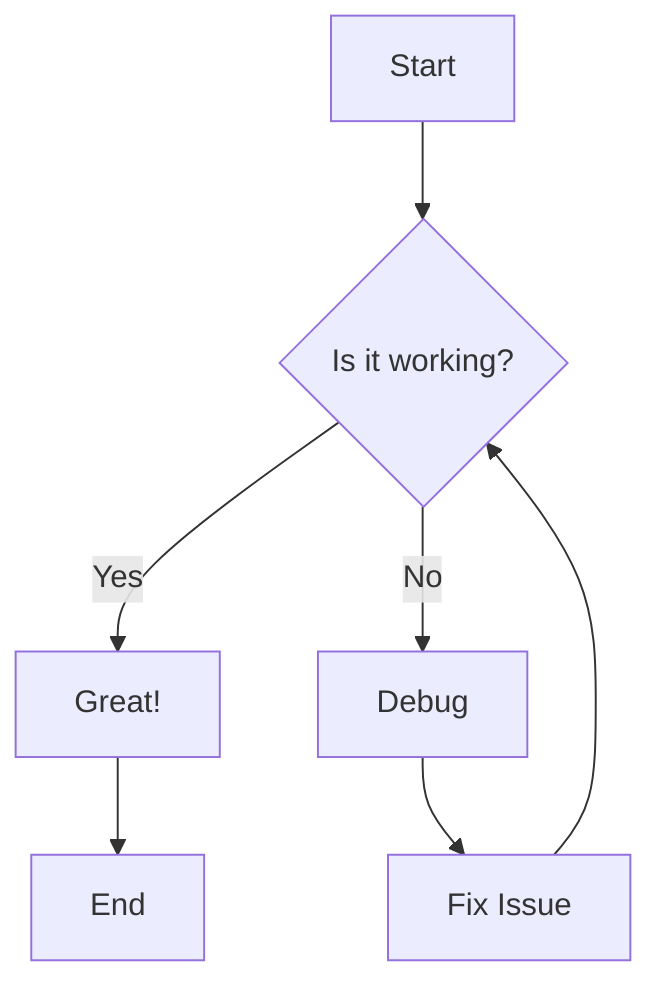
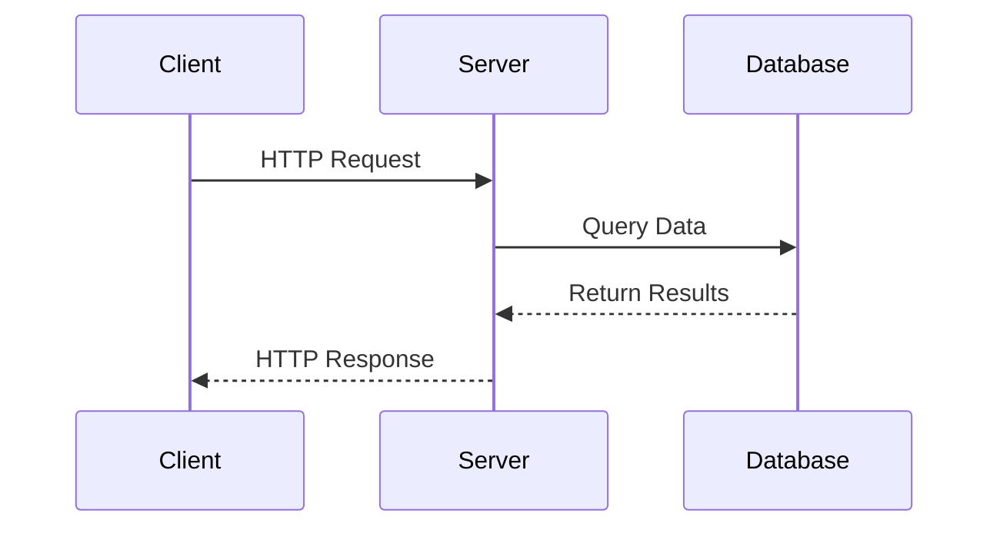
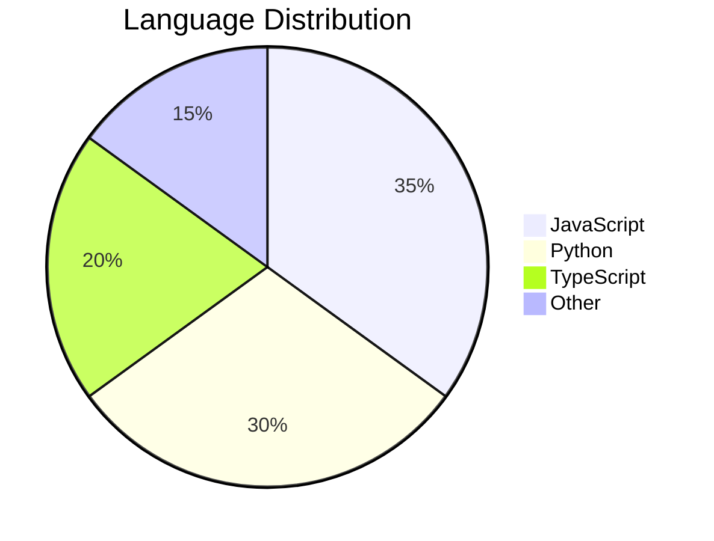

# Markdown Viewer

<div align="center" markdown="1">

**Advanced markdown viewer with translation, diagram rendering, and export capabilities**

[](LICENSE)
[](https://www.python.org/)
[](https://www.electronjs.org/)
[](SECURITY.md)

</div>

A powerful, secure desktop application for viewing, editing, and exporting markdown documents. Similar to Typora, but with advanced transformation capabilities, enterprise-grade security, and extensive export options.

---

## ✨ Features

### 📝 **Rich Markdown Rendering**
- Full GitHub Flavored Markdown (GFM) support
- Syntax highlighting for 180+ programming languages (Pygments)
- Tables, task lists, footnotes, and more
- Real-time preview with live rendering

### 📊 **Diagram Support**
- **Mermaid diagrams**: Flowcharts, sequence diagrams, pie charts, Gantt charts, state diagrams, and more
- Real-time diagram rendering
- Diagrams preserved in all export formats

### 🔢 **Math Equations**
- KaTeX integration for beautiful math rendering
- Inline equations: `$E = mc^2$`
- Block equations with full LaTeX syntax support
- Perfect rendering in exports

### 📄 **Export Capabilities**
- **PDF Export**: High-quality, print-ready PDFs with Playwright
- **Word Export** (.docx): Editable documents with formatting intact
- Preserves images, tables, code blocks, and diagrams
- Custom styling and formatting options

### 🌐 **Translation**
- Translate markdown content to 15+ languages
- Preserves markdown formatting and code blocks
- Smart handling of technical content
- Powered by [MyMemory](https://mymemory.translated.net/) (free, official translation API)

### 🔒 **Enterprise-Grade Security**
- **Hardened Electron configuration** with context isolation
- **CSRF protection** on all API endpoints
- **Content Security Policy** (CSP) headers
- **Input validation** with Marshmallow schemas
- **Path traversal protection** for file operations
- **Localhost-only binding** by default
- See [SECURITY.md](SECURITY.md) for details

### 🛠️ **Productivity Tools**
- Copy all content with one click
- Share via email
- Keyboard shortcuts (Ctrl+O, Ctrl+Shift+C, F5, F11)
- Auto-refresh on file changes
- Drag-and-drop file opening

### 🎨 **Beautiful Interface**
- Clean, modern Electron-based desktop UI
- Syntax-highlighted code blocks
- Responsive design
- Professional typography

---

## 📦 Installation

### Quick Install (Windows)

```powershell
# Run the installation script
.\scripts\install.bat

# Start the application
$env:FLASK_ENV = 'development'; poetry run markdown-viewer --browser
```

### Quick Install (macOS/Linux)

```bash
# Make script executable and run
chmod +x scripts/install.sh && ./scripts/install.sh

# Start the application
FLASK_ENV=development poetry run markdown-viewer --browser
```

### Manual Installation with Poetry (Recommended)

```bash
# Clone the repository
git clone https://github.com/dimpletz/markdown-viewer.git
cd markdown-viewer

# Install dependencies with Poetry
poetry install

# Install Playwright browsers (for PDF export)
poetry run playwright install

# Install Electron dependencies
cd markdown_viewer/electron
npm install
cd ../..

# Configure environment variables
cp .env.example .env
# Edit .env and set SECRET_KEY (see Security Setup below)
```

### Installation with pip

```bash
# Install from PyPI (if published)
pip install markdown-viewer-app

# Or install from source
pip install -e .

# Install Playwright browsers
playwright install
```

### 🔒 Security Setup (Required)

Before first run, you **must** configure a secret key:

```bash
# Copy the environment template
cp .env.example .env

# Generate a secure secret key (Linux/macOS)
python -c "import secrets; print(secrets.token_hex(32))" >> .env

# Or on Windows (PowerShell)
python -c "import secrets; print('SECRET_KEY=' + secrets.token_hex(32))" | Out-File -Append .env

# Edit .env and ensure SECRET_KEY is set
```

Your `.env` file should contain:
```env
SECRET_KEY=your_generated_secret_key_here
FLASK_ENV=production
```

**⚠️ Important:** The application will not start without a valid SECRET_KEY set in your environment.

---

## 🚀 Quick Start

### `markdown-viewer` — Full interactive app (Open / Translate / Export / Share)

```powershell
# Start the full UI in your browser (development mode, auto-generates SECRET_KEY)
$env:FLASK_ENV = 'development'; poetry run markdown-viewer --browser

# Start on a custom port
$env:FLASK_ENV = 'development'; poetry run markdown-viewer --browser --port 8080

# Server only — no GUI, API accessible at http://localhost:5000
$env:FLASK_ENV = 'development'; poetry run markdown-viewer --no-gui

# Stop the server
# Press Ctrl+C  — or —
Get-Process python* | Stop-Process -Force
```

> **Note:** In production set a real `SECRET_KEY` environment variable instead of using `FLASK_ENV=development`.

---

### `mdview` — Single-file CLI renderer (no server required)

```powershell
# Render a file and open it in the browser
poetry run mdview README.md

# Save the rendered HTML to a specific file
poetry run mdview README.md -o output.html

# Save as README.html (same name, .html extension)
poetry run mdview README.md --keep

# Render but don't open the browser
poetry run mdview README.md --no-browser

# Export to PDF
poetry run mdview README.md --export-pdf
poetry run mdview README.md --export-pdf report.pdf        # custom output path

# Export to Word (.docx)
poetry run mdview README.md --export-word
poetry run mdview README.md --export-word report.docx      # custom output path

# Export both PDF and Word in one command
poetry run mdview README.md --export-pdf --export-word

# Export PDF and open email client to share
poetry run mdview README.md --share-pdf

# Export Word and open email client to share
poetry run mdview README.md --share-word

# Show version
poetry run mdview --version
```

---

### Using the Full App

Once `markdown-viewer --browser` is running, open `http://localhost:5000` and:

1. Click **Open** (or press `Ctrl+O`) to load a `.md` file
2. **PDF / Word** buttons export the current document
3. **Translate** button opens the language selector
4. **Copy All** copies the raw markdown to clipboard
5. **Share** downloads the `.md` file and opens your email client
6. Press `F5` to refresh / reload the current file

---

## 📖 Markdown Examples

### Basic Formatting

```markdown
# Heading 1
## Heading 2
### Heading 3

This is **bold text** and this is *italic text*.

This is ~~strikethrough~~ and this is ==highlighted==.

- Unordered list item 1
- Unordered list item 2
  - Nested item

1. Ordered list item 1
2. Ordered list item 2

[Link to example](https://example.com)


```

### Code Blocks with Syntax Highlighting

````markdown
```python
def fibonacci(n):
    if n <= 1:
        return n
    return fibonacci(n-1) + fibonacci(n-2)

print(fibonacci(10))
```

```javascript
const greeting = (name) => {
  return `Hello, ${name}!`;
};

console.log(greeting('World'));
```

```sql
SELECT users.name, COUNT(orders.id) as order_count
FROM users
LEFT JOIN orders ON users.id = orders.user_id
GROUP BY users.id
HAVING order_count > 5;
```
````

### Tables

| Feature | Markdown Viewer | Typora | VS Code |
|---------|----------------|--------|----------|
| Export PDF | ✅ | ✅ | ❌ |
| Export Word | ✅ | ✅ | ❌ |
| Translation | ✅ | ❌ | ❌ |
| Math Equations | ✅ | ✅ | ✅ |
| Diagrams | ✅ | ✅ | ✅ |
| Free & Open Source | ✅ | ❌ | ✅ |

### Mermaid Diagrams







### Math Equations

Inline math: The quadratic formula is $x = \frac{-b \pm \sqrt{b^2-4ac}}{2a}$

Display math:

$$
\int_{-\infty}^{\infty} e^{-x^2} dx = \sqrt{\pi}
$$

$$
\nabla \times \vec{E} = -\frac{\partial \vec{B}}{\partial t}
$$

$$
\begin{bmatrix}
a & b \\
c & d
\end{bmatrix}
\begin{bmatrix}
x \\
y
\end{bmatrix}
=
\begin{bmatrix}
ax + by \\
cx + dy
\end{bmatrix}
$$

### Task Lists

- [x] Install Markdown Viewer
- [x] Open first document
- [x] Try exporting to PDF
- [ ] Translate to another language
- [ ] Explore all features

### Blockquotes

> "The best way to predict the future is to invent it."
> 
> — Alan Kay

> **Note:** This is an important callout.
>
> Multi-paragraph blockquotes are supported.

### Footnotes

```markdown
Here's a sentence with a footnote[^1].

Here's another with a longer footnote[^longnote].

[^1]: This is the first footnote.
[^longnote]: Here's one with multiple paragraphs and code.

    Indent paragraphs to include them in the footnote.
    
    Add as many as you like.
```

---

## 🔧 Development

### Prerequisites

- **Python 3.8+** (3.10+ recommended)
- **Node.js 16+** and npm
- **Poetry** for Python dependency management
- Git

### Setup Development Environment

```bash
# Clone the repository
git clone https://github.com/dimpletz/markdown-viewer.git
cd markdown-viewer

# Install Python dependencies
poetry install

# Install Playwright browsers (for PDF export)
poetry run playwright install

# Install Electron dependencies
cd markdown_viewer/electron
npm install
cd ../..

# Set up environment variables
cp .env.example .env
# Edit .env and set SECRET_KEY
```

### Running in Development Mode

**Option 1: Integrated (recommended)**
```bash
# Starts both Flask backend and Electron frontend
poetry run markdown-viewer
```

**Option 2: Separate processes**
```bash
# Terminal 1: Start Flask backend
poetry run python -m markdown_viewer --no-gui

# Terminal 2: Start Electron in development mode
cd markdown_viewer/electron
npm start
```

### Project Structure

```
markdown-viewer/
├── markdown_viewer/           # Python package
│   ├── __init__.py
│   ├── __main__.py           # Entry point
│   ├── app.py                # Flask application factory
│   ├── routes.py             # API endpoints
│   ├── server.py             # Server management
│   ├── electron/             # Electron app
│   │   ├── main.js           # Electron main process
│   │   ├── preload.js        # Secure IPC bridge
│   │   └── renderer/         # Frontend UI
│   │       ├── index.html
│   │       ├── scripts/
│   │       └── styles/
│   ├── exporters/            # PDF & Word export
│   │   ├── pdf_exporter.py
│   │   └── word_exporter.py
│   ├── processors/           # Markdown processing
│   │   └── markdown_processor.py
│   ├── translators/          # Translation service
│   │   └── content_translator.py
│   └── utils/                # Utilities
│       └── file_handler.py
├── tests/                    # Test suite
├── examples/                 # Example markdown files
├── .env.example              # Environment template
├── SECURITY.md               # Security documentation
└── README.md                 # This file
```

### Code Quality

```bash
# Run tests
poetry run pytest

# With coverage report
poetry run pytest --cov=markdown_viewer --cov-report=html

# Run linting
poetry run flake8 markdown_viewer

# Format code
poetry run black markdown_viewer

# Type checking
poetry run mypy markdown_viewer
```

### Building Distribution

**Python Package:**
```bash
# Build wheel and sdist
poetry build

# Install locally
pip install dist/markdown_viewer-1.0.0-py3-none-any.whl
```

**Electron Executable:**
```bash
cd markdown_viewer/electron

# Build for all platforms
npm run build

# Platform-specific builds
npm run build:win     # Windows (NSIS installer)
npm run build:mac     # macOS (DMG)
npm run build:linux   # Linux (AppImage, deb)
```

---

## 🧪 Testing

### Run Tests

```bash
# Run all tests
poetry run pytest

# Run with verbose output
poetry run pytest -v

# Run specific test file
poetry run pytest tests/test_processor.py

# Run with coverage
poetry run pytest --cov=markdown_viewer --cov-report=html
# Open htmlcov/index.html for coverage report
```

### Test Coverage

Current test coverage includes:
- ✅ Markdown processing and rendering
- ✅ File operations and encoding detection
- ✅ Export functionality (PDF, Word)
- ✅ Input validation and security

Target: 80%+ code coverage

---

## 📚 API Reference

The Flask backend exposes a RESTful API on `http://localhost:5000` (configurable).

### Health Check

```http
GET /api/health
```

**Response:**
```json
{
  "status": "ok",
  "version": "1.0.0"
}
```

### Render Markdown

```http
POST /api/render
Content-Type: application/json

{
  "content": "# Hello World\n\nThis is **markdown**.",
  "options": {
    "full_html": false
  }
}
```

**Response:**
```json
{
  "html": "<h1>Hello World</h1><p>This is <strong>markdown</strong>.</p>",
  "success": true
}
```

### Open File

```http
POST /api/file/open
Content-Type: application/json

{
  "path": "/path/to/document.md"
}
```

**Response:**
```json
{
  "content": "# Document\n\nContent here...",
  "filename": "document.md",
  "success": true
}
```

### Export to PDF

```http
POST /api/export/pdf
Content-Type: application/json

{
  "html": "<h1>Document</h1><p>Content</p>",
  "filename": "document.pdf"
}
```

**Response:** Binary PDF file download

### Export to Word

```http
POST /api/export/word
Content-Type: application/json

{
  "html": "<h1>Document</h1><p>Content</p>",
  "markdown": "# Document\n\nContent",
  "filename": "document.docx"
}
```

**Response:** Binary DOCX file download

### Translate Content

```http
POST /api/translate
Content-Type: application/json

{
  "content": "# Hello World\n\nThis is a test.",
  "source_lang": "en",
  "target_lang": "es"
}
```

**Response:**
```json
{
  "translated": "# Hola Mundo\n\nEsto es una prueba.",
  "success": true
}
```

### Security Features

All API endpoints include:
- ✅ **Input validation** with Marshmallow schemas
- ✅ **CSRF protection** (Flask-WTF)
- ✅ **CORS restrictions** (localhost only)
- ✅ **Path traversal protection**
- ✅ **Request logging** with unique request IDs
- ✅ **Error handling** with structured responses

---

## 🔒 Security

This application implements multiple security layers:

### Electron Security
- **Context Isolation**: Enabled (`contextIsolation: true`)
- **Node Integration**: Disabled (`nodeIntegration: false`)
- **Sandbox**: Enabled (`sandbox: true`)
- **Secure IPC**: Whitelisted channels via preload script
- **CSP**: Content Security Policy headers configured

### Backend Security
- **SECRET_KEY**: Required from environment (mandatory)
- **CORS**: Restricted to localhost origins only
- **CSRF Protection**: Enabled on all state-changing endpoints
- **Input Validation**: Marshmallow schemas on all inputs
- **Path Validation**: Prevents directory traversal attacks
- **Localhost Binding**: Server binds to 127.0.0.1 by default

### Best Practices
- No hardcoded secrets
- Structured logging with request IDs
- Proper resource cleanup (context managers)
- Specific exception handling
- Type hints throughout codebase

For detailed security information, see [SECURITY.md](SECURITY.md).

---

## ⌨️ Keyboard Shortcuts

| Shortcut | Action |
|----------|--------|
| `Ctrl+O` / `Cmd+O` | Open file dialog |
| `Ctrl+Shift+C` / `Cmd+Shift+C` | Copy all content to clipboard |
| `F5` | Refresh/reload current file |
| `F11` | Toggle fullscreen mode |
| `Ctrl+Q` / `Cmd+Q` | Quit application |

---

## 🤝 Contributing

Contributions are welcome! Here's how you can help:

### Ways to Contribute

- 🐛 **Report bugs** - Create an issue with details
- 💡 **Suggest features** - Share your ideas
- 📖 **Improve documentation** - Help others understand
- 🔧 **Submit pull requests** - Fix bugs or add features
- ⭐ **Star the project** - Show your support

### Development Workflow

1. **Fork** the repository
2. **Clone** your fork: `git clone https://github.com/dimpletz/markdown-viewer.git`
3. **Create a branch**: `git checkout -b feature/amazing-feature`
4. **Make changes** and commit: `git commit -m 'Add amazing feature'`
5. **Run tests**: `poetry run pytest`
6. **Push** to your fork: `git push origin feature/amazing-feature`
7. **Open a Pull Request** with a clear description

### Code Standards

- Follow [PEP 8](https://pep8.org/) for Python code
- Use `black` for code formatting
- Add type hints to all functions
- Write tests for new features
- Update documentation as needed
- Follow security best practices (see [SECURITY.md](SECURITY.md))

### Commit Messages

Use clear, descriptive commit messages:

```
feat(export): add custom PDF margins option
fix(security): validate file paths in open endpoint
docs(readme): update installation instructions
test(processor): add edge case tests for markdown rendering
```

---

## 📄 License

This project is licensed under the **MIT License** - see the [LICENSE](LICENSE) file for details.

```
MIT License

Copyright (c) 2026 Ofelia B Webb

Permission is hereby granted, free of charge, to any person obtaining a copy
of this software and associated documentation files (the "Software"), to deal
in the Software without restriction, including without limitation the rights
to use, copy, modify, merge, publish, distribute, sublicense, and/or sell
copies of the Software, and to permit persons to whom the Software is
furnished to do so, subject to the following conditions:

The above copyright notice and this permission notice shall be included in all
copies or substantial portions of the Software.
```

---

## 🙏 Acknowledgments

This project is built on top of excellent open-source technologies:

### Core Technologies
- **[Flask](https://flask.palletsprojects.com/)** - Lightweight Python web framework
- **[Electron](https://www.electronjs.org/)** - Cross-platform desktop applications
- **[Poetry](https://python-poetry.org/)** - Python dependency management

### Rendering & Processing
- **[Python-Markdown](https://python-markdown.github.io/)** - Markdown parser
- **[Pygments](https://pygments.org/)** - Syntax highlighting (180+ languages)
- **[Marked](https://marked.js.org/)** - Fast JavaScript markdown parser
- **[Mermaid](https://mermaid.js.org/)** - Diagram and flowchart rendering
- **[KaTeX](https://katex.org/)** - Fast math typesetting library
- **[Highlight.js](https://highlightjs.org/)** - Syntax highlighting for the web

### Export & Translation
- **[Playwright](https://playwright.dev/)** - Browser automation for PDF generation
- **[python-docx](https://python-docx.readthedocs.io/)** - Word document creation
- **[deep-translator](https://github.com/nidhaloff/deep-translator)** - Translation service wrapper (via [MyMemory API](https://mymemory.translated.net/))

### Security & Quality
- **[Flask-WTF](https://flask-wtf.readthedocs.io/)** - CSRF protection
- **[Flask-CORS](https://flask-cors.readthedocs.io/)** - CORS handling
- **[Marshmallow](https://marshmallow.readthedocs.io/)** - Input validation
- **[DOMPurify](https://github.com/cure53/DOMPurify)** - XSS sanitization

---

## 🐛 Known Issues & Limitations

- PDF export requires Playwright browsers to be installed (`playwright install`)
- Translation requires active internet connection
- Very large files (>10MB) may have slower rendering
- Some complex nested Mermaid diagrams may require syntax adjustments
- Word export has limited support for complex CSS styling

See [Issues](https://github.com/dimpletz/markdown-viewer/issues) for current known issues.

---

## 💬 Support & Contact

### Getting Help

- 📖 **Documentation**: Check this README and [INSTALLATION.md](docs/INSTALLATION.md)
- 📤 **CLI Export & Share**: See [EXPORT_FEATURES.md](docs/EXPORT_FEATURES.md) for CLI export/share commands
- �🔒 **Security**: See [SECURITY.md](SECURITY.md)
- 🐛 **Bug Reports**: [Open an issue](https://github.com/dimpletz/markdown-viewer/issues/new)
- 💡 **Feature Requests**: [Start a discussion](https://github.com/dimpletz/markdown-viewer/discussions)

### Author

**Ofelia B Webb**  
GitHub: [@dimpletz](https://github.com/dimpletz)

---

## 🗺️ Roadmap

### Version 1.x
- [x] Core markdown rendering
- [x] Mermaid diagram support
- [x] Math equation rendering
- [x] PDF export
- [x] Word export
- [x] Translation feature
- [x] Security hardening
- [x] Input validation

### Version 2.0 (Planned)
- [ ] **Dark mode** theme with toggle
- [ ] **Custom CSS themes** - User-defined styling
- [ ] **Live preview** while editing
- [ ] **Split view** - Edit and preview side-by-side
- [ ] **Automatic save** - Save on every change
- [ ] **Recent files** menu
- [ ] **Search and replace** in document

### Future Enhancements
- [ ] **Plugin system** for extensibility
- [ ] **Cloud sync** (Dropbox, Google Drive, OneDrive)
- [ ] **Collaborative editing** (real-time)
- [ ] **Git integration** for version control
- [ ] **PlantUML** diagram support
- [ ] **Custom export templates**
- [ ] **Offline translation** with local models
- [ ] **Mobile app** (React Native)

Vote on features or suggest new ones in [Discussions](https://github.com/dimpletz/markdown-viewer/discussions)!

---

## 📊 Project Statistics


**Project Status**: 🟢 Active Development & Maintenance

---

## ⚡ Performance

- **Startup Time**: < 2 seconds
- **Rendering Speed**: Instant for files up to 5MB
- **Memory Usage**: ~150MB average
- **PDF Generation**: ~3 seconds for typical document
- **Word Export**: ~1-2 seconds

---

## 🌟 Why Choose Markdown Viewer?

| Feature | Markdown Viewer | Typora | VS Code | Obsidian |
|---------|----------------|--------|---------|----------|
| **Free & Open Source** | ✅ | ❌ | ✅ | ✅ |
| **PDF Export** | ✅ | ✅ | ❌ | ✅ (plugin) |
| **Word Export** | ✅ | ✅ | ❌ | ❌ |
| **Translation** | ✅ | ❌ | ❌ | ❌ |
| **Mermaid Diagrams** | ✅ | ✅ | ✅ | ✅ |
| **Math Equations** | ✅ | ✅ | ✅ | ✅ |
| **Security Hardened** | ✅ | ❓ | ✅ | ❓ |
| **Cross-Platform** | ✅ | ✅ | ✅ | ✅ |
| **Lightweight** | ✅ | ✅ | ❌ | ✅ |

---

<div align="center" markdown="1">

**Made with ❤️ using Markdown Viewer**

⭐ **Star this repo** if you find it useful!

[Report Bug](https://github.com/dimpletz/markdown-viewer/issues) · [Request Feature](https://github.com/dimpletz/markdown-viewer/issues) · [Contribute](https://github.com/dimpletz/markdown-viewer/pulls)

---

*Last Updated: April 2026*

</div>
