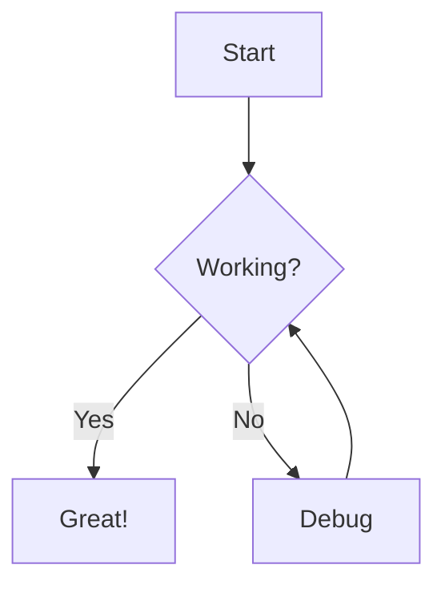
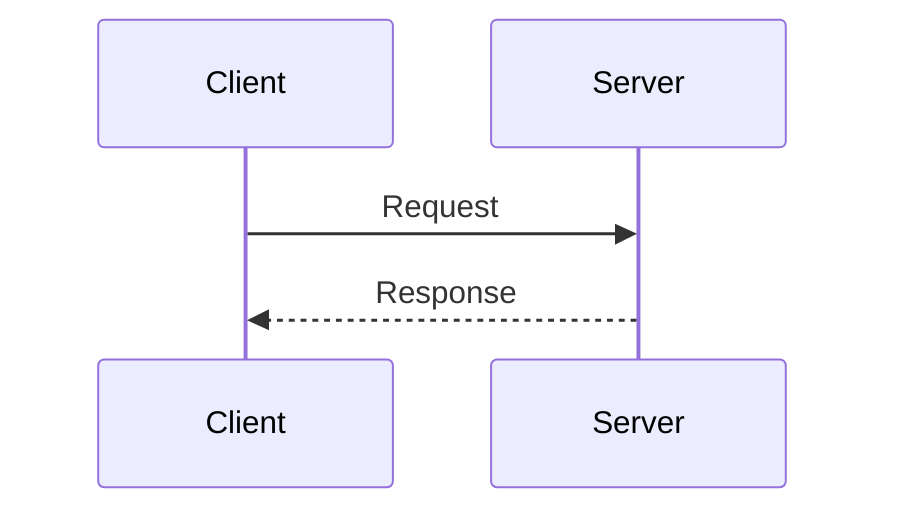

# Markdown Viewer

<div align="center" markdown="1">

**View, export, and translate markdown files — straight from the terminal**

[](LICENSE) [](https://www.python.org/) [](https://pypi.org/project/markdown-viewer-app/) [](SECURITY.md)

</div>

Open any markdown file in a full browser UI with one command. Supports PDF and Word export, Mermaid diagrams, math equations, syntax highlighting, and content translation.

---

## 📦 Installation

```bash
pip install markdown-viewer-app
playwright install chromium
```

> `playwright install chromium` is a **one-time setup** (~140 MB) required for PDF export. Skip it if you don't need PDF export.

---

## 🚀 Quick Start

```bash
# Open a file in your browser
mdview README.md

# Export to PDF
mdview README.md --export-pdf

# Export to Word
mdview README.md --export-word

# Export to both at once
mdview README.md --export-pdf --export-word

# Render to HTML only (no browser — useful for CI/CD)
mdview README.md --no-browser

# Save HTML to a specific file
mdview README.md -o output.html
```

When you run `mdview <file>`, the app:
1. Starts a background server on port 5000 (silently — no extra window opens)
2. Opens your browser directly to the rendered file
3. Returns you to the terminal immediately

The server keeps running in the background. Subsequent `mdview` calls reuse it instantly.

---

## ✨ Features

### 📝 Rich Markdown Rendering
- Full GitHub Flavored Markdown (GFM) support
- Syntax highlighting for 180+ programming languages
- Tables, task lists, footnotes, blockquotes, and more
- Emoji support with correct Unicode rendering

### 📊 Diagram Support
- **Mermaid**: flowcharts, sequence diagrams, pie charts, Gantt charts, state diagrams
- Diagrams are preserved in all export formats

### 🔢 Math Equations
- KaTeX integration for beautiful math rendering
- Inline: `$E = mc^2$`
- Block equations with full LaTeX syntax

### 📄 Export
- **PDF** — high-quality, print-ready (powered by Playwright/Chromium)
- **Word (.docx)** — editable documents with preserved formatting
- Silent: no popup dialogs, status bar updates on completion

### 🌐 Translation
- Translate content to 15+ languages directly from the UI
- Preserves markdown formatting and code blocks
- Powered by [MyMemory](https://mymemory.translated.net/) (free API, no key needed)

### 🔒 Security
- CSRF protection on all API endpoints
- Content Security Policy (CSP) headers
- Input validation with Marshmallow schemas
- Path traversal protection
- Localhost-only server binding (127.0.0.1)

### 🛠️ Productivity Tools
- Copy all content with one click
- Share via email
- Keyboard shortcuts: `Ctrl+O` (open), `Ctrl+Shift+C` (copy), `F5` (refresh), `F11` (fullscreen)

---

## 📖 Markdown Reference

### Basic Formatting

```markdown
# Heading 1
## Heading 2
### Heading 3

**bold**, *italic*, ~~strikethrough~~, ==highlighted==

- Unordered list
  - Nested item

1. Ordered list

[Link text](https://example.com)

```

### Code Blocks

````markdown
```python
def fibonacci(n):
    if n <= 1:
        return n
    return fibonacci(n-1) + fibonacci(n-2)
```

```sql
SELECT name, COUNT(*) FROM users GROUP BY name;
```
````

### Tables

```markdown
| Feature        | Markdown Viewer | Typora | VS Code |
|----------------|:---------------:|:------:|:-------:|
| PDF Export     | ✅              | ✅     | ❌      |
| Word Export    | ✅              | ✅     | ❌      |
| Translation    | ✅              | ❌     | ❌      |
| Diagrams       | ✅              | ✅     | ✅      |
| Free & Open    | ✅              | ❌     | ✅      |
```

### Mermaid Diagrams

````markdown



````

### Math Equations

```markdown
Inline: $x = \frac{-b \pm \sqrt{b^2-4ac}}{2a}$

Block:
$$
\int_{-\infty}^{\infty} e^{-x^2} dx = \sqrt{\pi}
$$
```

### Task Lists

```markdown
- [x] Install Markdown Viewer
- [x] Open first document
- [ ] Try exporting to PDF
```

---

## 🔧 Development Setup

```bash
git clone https://github.com/dimpletz/markdown-viewer.git
cd markdown-viewer
poetry install
poetry run playwright install chromium
```

### Run

```bash
# Open a file (server auto-reloads on code changes)
poetry run mdview README.md

# Or start the server standalone
poetry run markdown-viewer --browser
```

### Tests

```bash
# Run all tests
poetry run pytest

# With coverage report
poetry run pytest --cov=markdown_viewer --cov-report=html
```

### Project Structure

```
markdown-viewer/
├── markdown_viewer/
│   ├── app.py                # Flask application factory
│   ├── routes.py             # API endpoints
│   ├── server.py             # Server management
│   ├── cli.py                # CLI entry point (mdview)
│   ├── electron/             # Browser UI (HTML/JS/CSS)
│   │   └── renderer/
│   │       ├── index.html
│   │       ├── scripts/
│   │       └── styles/
│   ├── exporters/            # PDF & Word export
│   ├── processors/           # Markdown processing
│   ├── translators/          # Translation service
│   └── utils/                # File handling
├── tests/
├── docs/
└── examples/
```

---

## 🐛 Known Limitations

- PDF export requires `playwright install chromium` (one-time ~140 MB download)
- Translation requires an internet connection
- Word export has limited support for complex CSS styling

---

## 📚 More Documentation

- [CLI Usage & Export Examples](docs/CLI_USAGE.md)
- [Export Features](docs/EXPORT_FEATURES.md)
- [Installation Guide](docs/INSTALLATION.md)
- [Security Policy](SECURITY.md)
- [Changelog](CHANGELOG.md)

---

## 🤝 Contributing

1. Fork the repository
2. Create a branch: `git checkout -b feature/my-feature`
3. Make your changes and add tests: `poetry run pytest`
4. Open a pull request

---

## 📄 License

MIT License — see [LICENSE](LICENSE) for details.

---

## 🙏 Acknowledgments

- **[Flask](https://flask.palletsprojects.com/)** — Python web framework
- **[Python-Markdown](https://python-markdown.github.io/)** — Markdown parser
- **[Playwright](https://playwright.dev/)** — PDF generation via Chromium
- **[python-docx](https://python-docx.readthedocs.io/)** — Word document export
- **[Mermaid](https://mermaid.js.org/)** — Diagram rendering
- **[KaTeX](https://katex.org/)** — Math typesetting
- **[Pygments](https://pygments.org/)** — Syntax highlighting
- **[DOMPurify](https://github.com/cure53/DOMPurify)** — XSS sanitization
- **[deep-translator](https://github.com/nidhaloff/deep-translator)** — Translation via [MyMemory API](https://mymemory.translated.net/)
