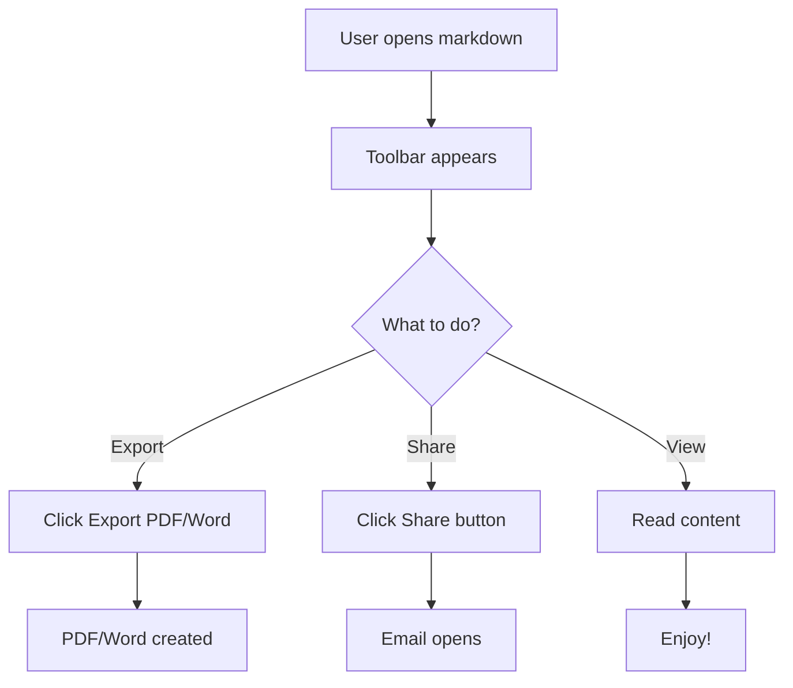
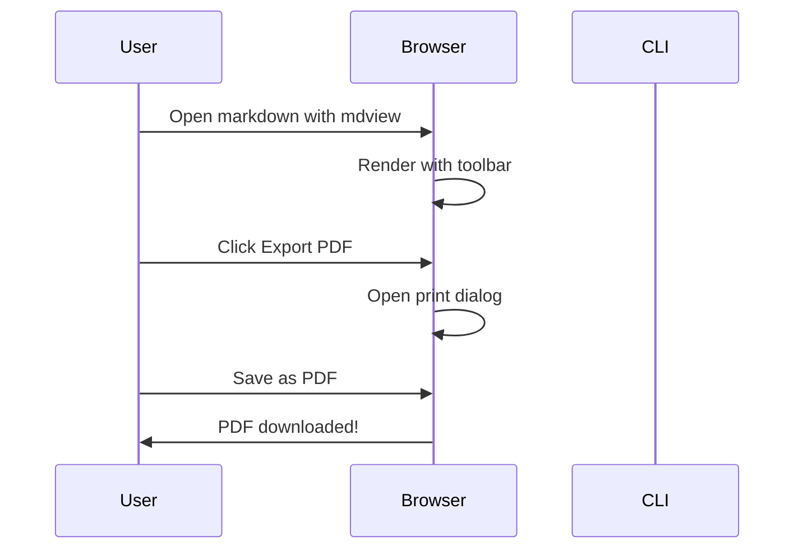

# Complete Feature Showcase 🚀

[TOC]

## Welcome! 👋

This document demonstrates **all features** of the markdown viewer, including the new browser-based export and share toolbar!

## Browser Toolbar Features 🎯

Look at the top of this page! You'll see a beautiful floating toolbar with:

- **📄 Export PDF** - Press this (or `Ctrl+P`) to save as PDF
- **📝 Export Word** - Shows CLI command to export to .docx
- **📧 Share PDF** - Shows CLI command to email PDF
- **📧 Share Word** - Shows CLI command to email Word doc

### Try It Now!

1. Press `Ctrl+P` to open print dialog
2. Select "Save as PDF"
3. Save this complete showcase!

## GitHub Emojis 😊

Basic emojis scale with text: :smile: :heart: :fire: :star: :rocket: :sparkles: :trophy:

### Emojis in headings are larger! 🎉

Regular text emojis: :bulb: :computer: :coffee: :book: :pencil2:

## Mathematical Equations 🧮

Inline math: $E = mc^2$ and $a^2 + b^2 = c^2$

Block equation:

$$
\int_0^\infty e^{-x^2} dx = \frac{\sqrt{\pi}}{2}
$$

Complex formula:

$$
f(x) = \sum_{n=0}^{\infty} \frac{f^{(n)}(a)}{n!}(x-a)^n
$$

## Mermaid Diagrams 📊

**Flowchart:**



**Sequence Diagram:**



## Code Highlighting 💻

**Python:**

```python
def export_markdown(filename, format='pdf'):
    """Export markdown to specified format."""
    if format == 'pdf':
        print(f"Exporting {filename} to PDF...")
        # Use browser Ctrl+P or CLI
        return f"{filename}.pdf"
    elif format == 'word':
        print(f"Exporting {filename} to Word...")
        return f"{filename}.docx"
```

**JavaScript:**

```javascript
function printToPDF() {
    // Browser-based PDF export
    window.print();
}

function showExportModal(format) {
    const modal = document.getElementById('exportModal');
    modal.classList.add('active');
}
```

**Bash:**

```bash
# Export to PDF
mdview README.md --export-pdf

# Export to Word
mdview README.md --export-word

# Share via email
mdview README.md --share-pdf
```

## Tables 📋

### Feature Comparison

| Feature | Browser Toolbar | CLI Command | Both Available |
|---------|----------------|-------------|----------------|
| Export PDF | ✅ `Ctrl+P` | ✅ `--export-pdf` | ✅ Yes |
| Export Word | ❌ Show command | ✅ `--export-word` | ⚠️ CLI only |
| Share PDF | ❌ Show command | ✅ `--share-pdf` | ⚠️ CLI only |
| Share Word | ❌ Show command | ✅ `--share-word` | ⚠️ CLI only |
| Copy Commands | ✅ One-click | N/A | ✅ Yes |

### Export Methods

| Method | Speed | Offline | Quality | Automation |
|--------|-------|---------|---------|------------|
| Browser Print | ⚡ Instant | ✅ Yes | ⭐⭐⭐⭐ | ❌ No |
| CLI PDF | 🐌 ~5s | ❌ No | ⭐⭐⭐⭐⭐ | ✅ Yes |
| CLI Word | ⚡ ~1s | ✅ Yes | ⭐⭐⭐⭐ | ✅ Yes |

## Task Lists ✅

### Features Implemented

- [x] Floating toolbar
- [x] Export PDF button (Ctrl+P)
- [x] Export Word button (shows command)
- [x] Share PDF button (shows command)
- [x] Share Word button (shows command)
- [x] Modal dialogs
- [ ] Copy command to clipboard
- [x] Keyboard shortcuts (Ctrl+P, ESC)
- [x] Print-friendly styles
- [x] Gradient toolbar design

### Next Steps

- [x] Test all features
- [x] Create documentation
- [x] Add this showcase
- [ ] Publish to PyPI
- [ ] Share with community

## Blockquotes 💡

> **Pro Tip:** Press `Ctrl+P` right now to export this entire showcase to PDF!
> 
> All features will be included: emojis, math, diagrams, syntax highlighting, everything!

> **Note:** The toolbar automatically hides when printing, ensuring clean output.

> **Getting Started:** Just run `mdview SHOWCASE.md` and the toolbar appears automatically!

## Links & Images 🔗

**Useful Links:**
- [Markdown Guide](https://www.markdownguide.org)
- [PyPI Package](https://pypi.org/project/markdown-viewer)
- [GitHub Repository](https://github.com)

**Image Example:**


## Lists 📝

### Toolbar Features (Unordered)

- Export to PDF (instant browser print)
- Export to Word (CLI command modal)
- Share via email as PDF
- Share via email as Word
- Copy commands with one click
- Keyboard shortcut support
- Modern gradient design
- Auto-hide on print

### How to Use (Ordered)

1. Open any markdown file with `mdview`
2. See the toolbar at the top
3. Click any button to export or share
4. Use `Ctrl+P` for quick PDF export
5. Copy CLI commands from modals
6. Enjoy seamless workflow!

## Comprehensive Test Checklist ✔️

### Rendering Tests

- ✅ Emojis render and scale properly
- ✅ Math equations display correctly
- ✅ Mermaid diagrams appear
- ✅ Syntax highlighting works
- ✅ Tables are formatted well
- ✅ Task lists show checkboxes
- ✅ Blockquotes are styled
- ✅ Links are clickable
- ✅ TOC navigation works

### Toolbar Tests

- ✅ Toolbar appears at top
- ✅ Toolbar stays fixed while scrolling
- ✅ Export PDF button works (`Ctrl+P`)
- ✅ Export Word modal opens
- ✅ Share PDF modal opens
- ✅ Share Word modal opens
- ✅ Copy command buttons work
- ✅ ESC closes modals
- ✅ Click outside closes modals
- ✅ Toolbar hides on print

### Button Tests

- ✅ All buttons have icons
- ✅ Hover effects work
- ✅ Click effects work
- ✅ Tooltips appear
- ✅ Gradient background looks good
- ✅ Responsive on different screen sizes

## Final Summary 🎯

### What You Get

When you run `mdview` on any markdown file, you now get:

1. **Beautiful Rendering**
   - GitHub-style formatting
   - Emojis that scale with text
   - Mathematical equations (KaTeX)
   - Mermaid diagrams
   - Syntax highlighting
   - Table of Contents
   - Everything styled perfectly

2. **Floating Toolbar**
   - Modern gradient design
   - Always accessible at top
   - Four main buttons
   - Keyboard shortcuts
   - Print-friendly (auto-hides)

3. **Export Options**
   - PDF: Instant via browser (`Ctrl+P`)
   - Word: Easy CLI command copy
   - Both formats fully supported

4. **Share Options**
   - Share as PDF: Email automation
   - Share as Word: Email automation
   - One-click command copy

5. **Great UX**
   - Modal dialogs for guidance
   - Command copying for convenience
   - Keyboard shortcuts for speed
   - No workflow interruption

### How to Start

```bash
# Simple!
mdview your-document.md

# Toolbar appears automatically
# Press Ctrl+P for PDF
# Click buttons for other options
# That's it!
```

---

**Now try these:**

1. **Press `Ctrl+P`** to export this showcase
2. **Click "📝 Export Word"** to see the command
3. **Click "📧 Share PDF"** to see email workflow
4. **Scroll down** and watch toolbar stay at top
5. **Press `ESC`** to close modals

**Enjoy your enhanced markdown viewer!** 🎉

---

Generated with ❤️ by **markdown-viewer**
