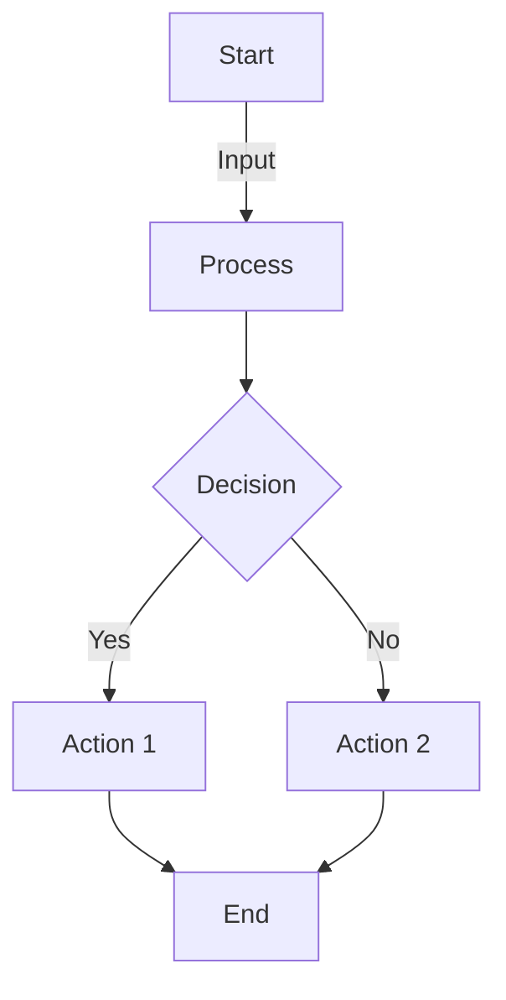
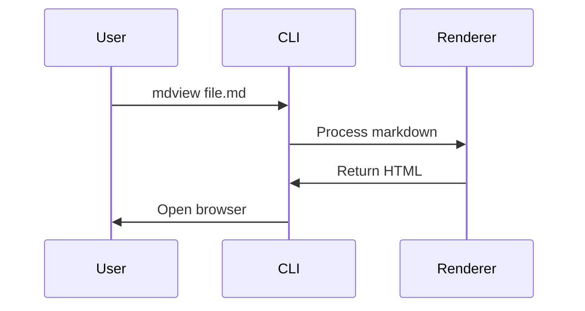

# Comprehensive Demo :rocket:

This demonstrates all major features of the markdown viewer.

[TOC]

## GitHub Emojis :tada:

Basic emojis: :smile: :heart: :fire: :star: :thumbsup:

More emojis: :bulb: :computer: :rocket: :sparkles: :trophy:

## Mathematical Equations :abacus:

Inline math: $E = mc^2$ and $a^2 + b^2 = c^2$

Block math:

$$
\int_0^\infty e^{-x^2} dx = \frac{\sqrt{\pi}}{2}
$$

More complex:

$$
\sum_{n=1}^{\infty} \frac{1}{n^2} = \frac{\pi^2}{6}
$$

## Mermaid Diagrams :chart_with_upwards_trend:

**Flowchart:**



**Sequence Diagram:**



## Code Highlighting :computer:

**Python:**

```python
def hello_world():
    """A simple greeting function."""
    message = "Hello, World!"
    print(message)
    return True
```

**JavaScript:**

```javascript
function greet(name) {
    // Modern JavaScript
    const message = `Hello, ${name}!`;
    console.log(message);
    return message;
}
```

**Bash:**

```bash
#!/bin/bash
# Deploy script
mdview README.md --no-browser -o dist/index.html
echo "Deployment complete!"
```

## Tables :clipboard:

| Feature | Status | Priority |
|---------|--------|----------|
| Emoji Support | ✅ Done | High |
| Math Rendering | ✅ Done | High |
| Mermaid Diagrams | ✅ Done | Medium |
| Syntax Highlighting | ✅ Done | High |

## Task Lists :ballot_box_with_check:

- [x] Implement CLI
- [x] Add emoji support
- [x] Add math rendering
- [x] Add Mermaid support
- [ ] Publish to PyPI

## Blockquotes :speech_balloon:

> **Note:** This is a comprehensive demo showcasing all features.

> **Warning:** Make sure to test all features before deploying.

## Links and Images :link:

[GitHub](https://github.com) | [Documentation](#) | [PyPI](https://pypi.org)

**Local Image Test:**


## Horizontal Rule

---

**Generated with** :sparkling_heart: **by markdown-viewer**
