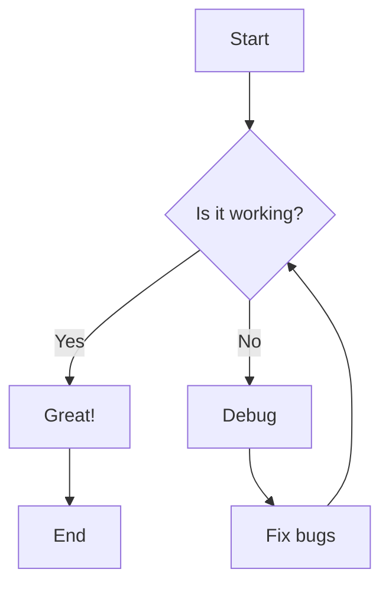
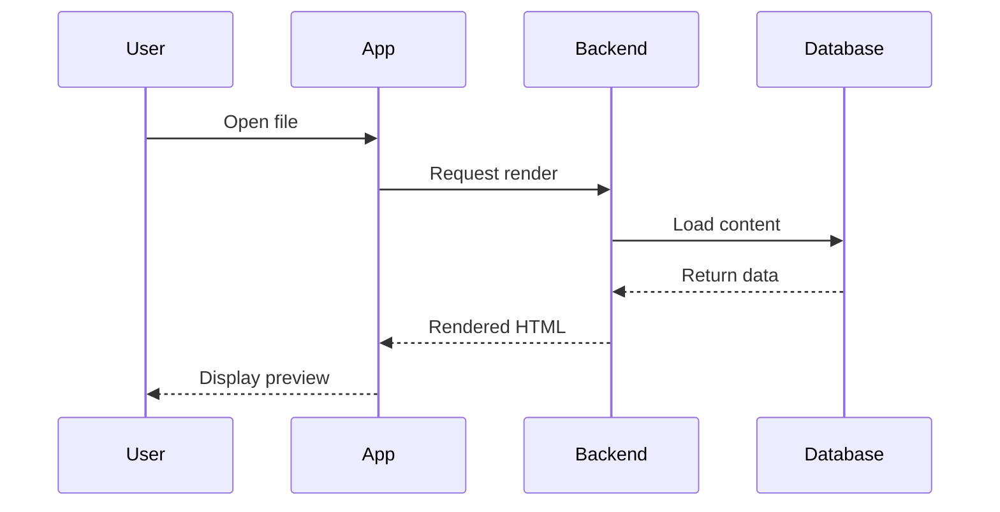
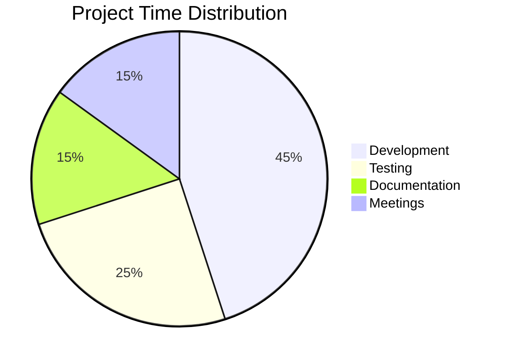
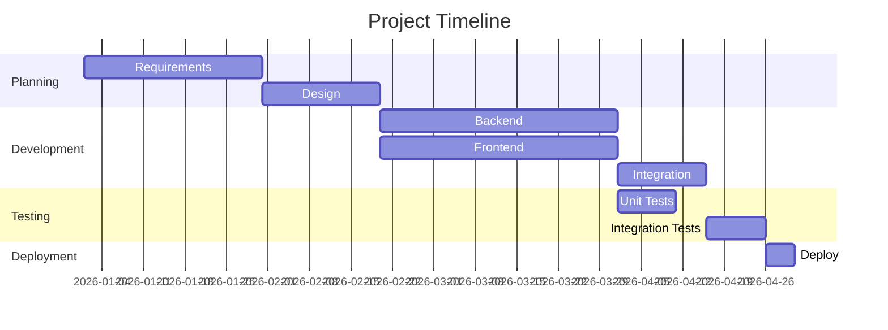

# Example Markdown Document

This is a comprehensive example demonstrating all the features of Markdown Viewer.

## Table of Contents

1. [Text Formatting](#text-formatting)
2. [Lists](#lists)
3. [Links and Images](#links-and-images)
4. [Code Blocks](#code-blocks)
5. [Tables](#tables)
6. [Blockquotes](#blockquotes)
7. [Mermaid Diagrams](#mermaid-diagrams)
8. [Math Equations](#math-equations)

---

## Text Formatting

You can make text **bold**, *italic*, ***bold and italic***, ~~strikethrough~~, and use `inline code`.

You can also use ==highlighted text== and subscript~2~ and superscript^2^.

> **Note**: Some formatting may require specific markdown extensions.

## Lists

### Unordered List

- Item 1
- Item 2
  - Nested item 2.1
  - Nested item 2.2
- Item 3

### Ordered List

1. First item
2. Second item
   1. Nested item 2.1
   2. Nested item 2.2
3. Third item

### Task List

- [x] Completed task
- [x] Another completed task
- [ ] Pending task
- [ ] Another pending task

## Links and Images

This is a [link to GitHub](https://github.com).

This is an .

## Code Blocks

### Python

```python
def fibonacci(n):
    """Calculate fibonacci number."""
    if n <= 1:
        return n
    return fibonacci(n-1) + fibonacci(n-2)

# Calculate first 10 fibonacci numbers
fib_numbers = [fibonacci(i) for i in range(10)]
print(fib_numbers)
```

### JavaScript

```javascript
// Async function example
async function fetchData(url) {
    try {
        const response = await fetch(url);
        const data = await response.json();
        return data;
    } catch (error) {
        console.error('Error:', error);
        throw error;
    }
}

// Arrow function
const greet = (name) => `Hello, ${name}!`;
console.log(greet('World'));
```

### SQL

```sql
-- Select with JOIN
SELECT 
    users.id,
    users.name,
    orders.order_date,
    orders.total
FROM users
INNER JOIN orders ON users.id = orders.user_id
WHERE orders.status = 'completed'
ORDER BY orders.order_date DESC
LIMIT 10;
```

## Tables

| Feature | Supported | Notes |
|---------|-----------|-------|
| Basic Markdown | ✅ | Full GFM support |
| Mermaid Diagrams | ✅ | Flowcharts, sequence, etc. |
| Math Equations | ✅ | KaTeX rendering |
| PDF Export | ✅ | High quality |
| Word Export | ✅ | Formatting preserved |
| Translation | ✅ | 15+ languages |

### Alignment Example

| Left Aligned | Center Aligned | Right Aligned |
|:-------------|:--------------:|--------------:|
| Cell 1       | Cell 2         | Cell 3        |
| Cell 4       | Cell 5         | Cell 6        |

## Blockquotes

> This is a blockquote.
> 
> It can span multiple lines.

> **Important Note**
> 
> Blockquotes can also contain formatting:
> - Lists
> - **Bold text**
> - `Code`

## Mermaid Diagrams

### Flowchart



### Sequence Diagram



### Pie Chart



### Gantt Chart



## Math Equations

### Inline Math

The famous equation is $E = mc^2$, where $E$ is energy, $m$ is mass, and $c$ is the speed of light.

The quadratic formula is $x = \frac{-b \pm \sqrt{b^2 - 4ac}}{2a}$.

### Block Math

**Pythagorean Theorem:**

$$
a^2 + b^2 = c^2
$$

**Integral:**

$$
\int_{-\infty}^{\infty} e^{-x^2} dx = \sqrt{\pi}
$$

**Summation:**

$$
\sum_{i=1}^{n} i = \frac{n(n+1)}{2}
$$

**Matrix:**

$$
\begin{bmatrix}
a & b \\
c & d
\end{bmatrix}
\begin{bmatrix}
x \\
y
\end{bmatrix}
=
\begin{bmatrix}
ax + by \\
cx + dy
\end{bmatrix}
$$

**Calculus:**

$$
\frac{d}{dx} \left( \int_a^x f(t) dt \right) = f(x)
$$

---

## Horizontal Rules

You can create horizontal rules with three or more hyphens, asterisks, or underscores:

---

***

___

## Footnotes

Here's a sentence with a footnote[^1].

[^1]: This is the footnote content.

## Definition Lists

Term 1
: Definition 1

Term 2
: Definition 2a
: Definition 2b

## Emojis

You can use emojis! 😀 🎉 🚀 ⭐ 

:smile: :tada: :rocket: :star: :heart:

---

## Tips for Best Results

1. **Images**: Use absolute paths or URLs for best compatibility
2. **Diagrams**: Keep mermaid syntax simple for reliable rendering
3. **Math**: Test complex equations before exporting
4. **Code**: Always specify the language for syntax highlighting
5. **Tables**: Keep tables reasonably sized for PDF export

## Export Options

This document can be exported to:

- **PDF**: Perfect for sharing and printing
- **Word**: For further editing in Microsoft Word
- **Copy All**: Copy the entire markdown to clipboard

## Translation

You can translate this document to:
- Spanish (Español)
- French (Français)
- German (Deutsch)
- Chinese (中文)
- Japanese (日本語)
- And many more!

---

**Created with** ❤️ **using Markdown Viewer**

*Try all the features: Export, Translate, Copy, and Share!*
